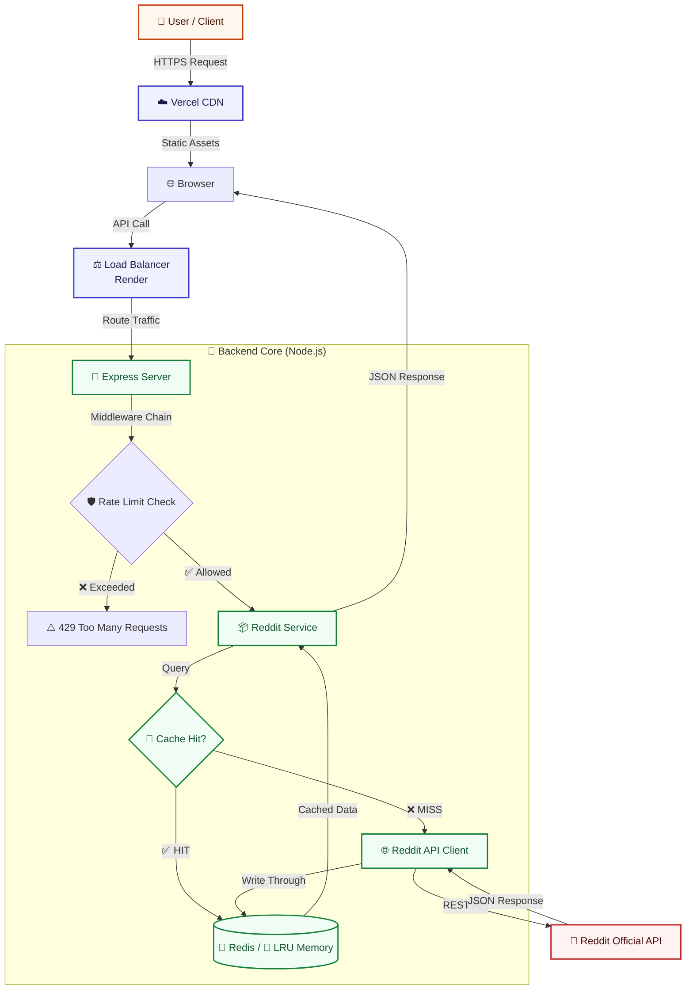

<div align="center">

# 🎯 Reddit MCP

### The Front Page, Refined

[](LICENSE)
[](https://www.typescriptlang.org/)
[](https://nextjs.org/)
[](https://www.docker.com/)
[](https://redis.io/)
[](https://reddit-mcp.vercel.app)

**A privacy-focused, minimalist search engine for Reddit built with Model Context Protocol architecture**

[View Live Demo](https://reddit-mcp.vercel.app) • [Report Bug](https://github.com/rajtejaswee/reddit-mcp/issues) • [Request Feature](https://github.com/rajtejaswee/reddit-mcp/issues)

</div>

---

## 📖 Overview

**Reddit MCP** is a production-grade engineering solution that transforms how users interact with Reddit's vast content ecosystem. By implementing the **Model Context Protocol (MCP)** architecture, it creates a clean separation between data context providers and presentation layers.

This project goes beyond a simple API wrapper—it's a sophisticated middleware layer that intelligently orchestrates data flow, implements enterprise-grade caching strategies, and ensures privacy-first design principles.

### 🎯 Core Objectives

| Objective | Implementation |
|-----------|----------------|
| **🔇 Zero Noise** | Eliminates ads, trackers, and algorithmic manipulation |
| **⚡ Performance** | Multi-tiered caching (LRU + Redis) with <50ms response times |
| **🛡️ Resilience** | Fixed-window rate limiting + Graceful error handling |
| **🔒 Privacy** | Ephemeral requests with zero user data persistence |
| **🤖 MCP Compliance** | Structured for LLM integration and AI agent workflows |

### 💡 The Problem We Solve

Modern social platforms suffer from:
- **Information Overload**: Algorithmic feeds prioritize engagement over relevance
- **Privacy Erosion**: Extensive user tracking and behavioral profiling
- **Performance Degradation**: Heavy client-side JavaScript and advertisements
- **Data Silos**: Difficult for AI agents to extract structured insights

**Reddit MCP** addresses these by providing a clean, fast, privacy-respecting interface to Reddit's public data.

---

## ✨ Features

### 🏗️ Infrastructure & Performance

- **⚡ Tiered Caching Strategy**
  - **Robust Error Handling:** Graceful error management ensures the UI never crashes, even when upstream Reddit APIs are unreachable.
  - **Adaptive Caching Strategy:** Implements the Strategy Pattern to dynamically select between Redis (for production horizontal scaling) and In-Memory LRU (for local development) based on infrastructure availability.
  
- **🛡️ Intelligent Rate Limiting**
  * **🛡️ IP-Based Rate Limiting:** Implements a Fixed Window strategy to throttle abusive traffic (30 req/min).
  * **🔒 Abuse Prevention:** Tracks requests per IP address to protect upstream Reddit API limits.
  * **🚦 Fail-Safe Headers:** Returns standard `Retry-After` headers compliant with HTTP specifications.

### 🔍 User Experience

- **🎨 Cinematic UI**
  - 60fps animations powered by Framer Motion
  - Smooth page transitions with optimistic updates
  - Skeleton loading states for perceived performance

- **📱 Responsive Design**
  - Mobile-first architecture
  - Adaptive layouts for all viewport sizes
  - Touch-optimized interactions

- **🔎 Advanced Search Capabilities**
  - Multi-mode sorting (Relevance, Top All-Time, Hot)
  - Real-time query debouncing
  - Infinite scroll with virtualization

### 🤖 MCP Architecture

- **Context Provider Pattern**: Backend acts as a stateless context provider
- **Protocol Compliance**: Ready for LLM integration (Claude, GPT-4, etc.)
- **Structured Responses**: JSON schemas validated with Zod

---

## 🏗️ System Architecture

The system implements a **Microservices-Inspired Monorepo** with clear separation of concerns between compute and presentation layers.


### 📊 Data Flow

1. **Request Initiation** → User interacts with Next.js frontend
2. **CDN Layer** → Vercel Edge Network serves static assets
3. **API Gateway** → Express server validates and routes requests
4. **Rate Limiting** → Token bucket checks prevent abuse
5. **Cache Lookup** → Active Cache Strategy (Redis or Memory) → API Fallback
6. **Response Caching** → Write-through strategy updates all cache tiers
7. **Client Delivery** → Optimized JSON payload returned to browser

---

## 🛠 Tech Stack

### Backend 

| Category | Technology | Purpose |
|----------|-----------|---------|
| **Runtime** | Node.js v20 | High-performance JavaScript execution |
| **Framework** | Express.js | Lightweight, unopinionated HTTP server |
| **Caching** | Redis + node-cache | Distributed & in-memory caching |
| **Validation** | Zod | Runtime type checking and schema validation |
| **Logging** | Pino | Structured JSON logging with low overhead |
| **Rate Limiting** | express-rate-limit | Token bucket algorithm implementation |
| **HTTP Client** | Axios | Promise-based HTTP requests with interceptors |

### Frontend 

| Category | Technology | Purpose |
|----------|-----------|---------|
| **Framework** | Next.js 14 (App Router) | React framework with SSR/SSG capabilities |
| **Styling** | Tailwind CSS | Utility-first CSS framework |
| **Animations** | Framer Motion | Production-ready motion library |
| **Icons** | Lucide React | Consistent, customizable icon set |
| **Language** | TypeScript (Strict) | Type safety across the stack |

### DevOps 

| Category | Technology | Purpose |
|----------|-----------|---------|
| **CI/CD** | GitHub Actions | Automated testing and deployment |
| **Containerization** | Docker + Compose | Environment consistency and orchestration |
| **Hosting** | Render + Vercel | Backend API + Frontend static hosting |
| **Monitoring** | Pino + LogTail (optional) | Centralized log aggregation |

---

## 🧩 Design Patterns & Best Practices

### 1️⃣ Dependency Injection Pattern

**Problem:** Tight coupling between services makes testing and swapping implementations difficult.

**Solution:** Constructor injection with interface contracts.
```typescript
class RedditService {
  constructor(
    private cache: ICache,        // Interface, not concrete class
    private httpClient: IHttpClient,
    private logger: ILogger
  ) {}
}

// Easy to mock in tests
const mockCache = new MockCache();
const service = new RedditService(mockCache, ...);
```

**Benefits:**
- ✅ Testability: Easy to inject mocks/stubs
- ✅ Flexibility: Swap implementations without changing business logic
- ✅ Separation of Concerns: Each layer has a single responsibility

---

### 2️⃣ Strategy Pattern (Cache Selection)

**Problem:** Need to switch between Redis and in-memory cache based on environment.

**Solution:** Common interface with runtime strategy selection.
```typescript
interface ICache {
  get(key: string): Promise<any>;
  set(key: string, value: any, ttl: number): Promise<void>;
}

class RedisCache implements ICache { /* ... */ }
class MemoryCache implements ICache { /* ... */ }

// Runtime selection
const cache = process.env.REDIS_URL 
  ? new RedisCache(process.env.REDIS_URL)
  : new MemoryCache();
```

**Benefits:**
- ✅ Zero code changes when scaling to Redis
- ✅ Consistent API regardless of storage backend
- ✅ Easy A/B testing of cache strategies

---

### 3️⃣ Adapter Pattern (API Client)

**Problem:** Reddit's API structure might change, breaking our application.

**Solution:** Isolate external API interactions behind an adapter.
```typescript
class RedditAPIAdapter {
  async searchPosts(query: string): Promise<NormalizedPost[]> {
    const rawData = await this.httpClient.get('/search.json');
    return this.normalize(rawData);  // Transform to internal schema
  }
  
  private normalize(raw: RedditRawResponse): NormalizedPost[] {
    // Shield app from Reddit API changes
    return raw.data.children.map(child => ({
      id: child.data.id,
      title: child.data.title,
      // ... map all fields
    }));
  }
}
```

**Benefits:**
- ✅ **Encapsulation**: Reddit API changes don't cascade through codebase
- ✅ **Type Safety**: Internal schemas remain consistent
- ✅ **Testing**: Mock external API easily

---

### 4️⃣ Singleton Pattern (Config & Logger)

**Problem:** Need shared state for configuration and logging across the app.

**Solution:** Singleton instances with lazy initialization.
```typescript
class Logger {
  private static instance: Logger;
  
  private constructor() { /* Initialize Pino */ }
  
  static getInstance(): Logger {
    if (!Logger.instance) {
      Logger.instance = new Logger();
    }
    return Logger.instance;
  }
}

export const logger = Logger.getInstance();
```

**Benefits:**
- ✅ Single source of truth for configuration
- ✅ Prevents multiple logger instances writing to same stream
- ✅ Memory efficient

---

## 🚀 Getting Started

### Prerequisites

Ensure you have the following installed:

- **Node.js** v20+ ([Download](https://nodejs.org/))
- **Docker** & **Docker Compose** ([Download](https://www.docker.com/get-started))
- **(Optional)** **Redis** for local development

---

### 🐳 Option A: Docker Deployment (Recommended)

**Perfect for production-like environment and quick setup**

1. **Clone the repository**
```bash
   git clone https://github.com/rajtejaswee/reddit-mcp.git
   cd reddit-mcp
```

2. **Start the entire stack**
```bash
   docker-compose up -d
```
   
   This command will:
   - ✅ Build backend and frontend images
   - ✅ Spin up Redis instance
   - ✅ Configure networking between services
   - ✅ Expose ports: `3000` (backend), `3001` (frontend)

3. **Verify deployment**
```bash
   # Check all containers are running
   docker-compose ps
   
   # View logs
   docker-compose logs -f
```

4. **Access the application**
   - 🌐 **Frontend**: http://localhost:3001
   - 🔌 **Backend API**: http://localhost:3000
   - 📊 **Health Check**: http://localhost:3000/health

5. **Stop the stack**
```bash
   docker-compose down
   # To remove volumes as well
   docker-compose down -v
```

---

### 💻 Option B: Local Development (Manual)

**Ideal for active development with hot reload**

#### 1. Setup Backend
```bash
# Navigate to project root
cd reddit-mcp

# Install dependencies
npm install

# Create environment file (optional, defaults provided)
cp .env.example .env

# Start development server with hot reload
npm run dev
```

**Expected Output:**
```
✓ Server running on http://localhost:3000
✓ Cache: In-Memory (LRU)
✓ Rate Limiting: Enabled (100 req/15min per IP)
```

#### 2. Setup Frontend
```bash
# Open new terminal, navigate to frontend
cd web

# Install dependencies
npm install

# Create environment file
cp .env.example .env.local

# Start Next.js dev server
npm run dev
```

**Expected Output:**
```
✓ Ready in 2.3s
✓ Local: http://localhost:3001
✓ Network: http://192.168.1.x:3001
```

---

## 🔌 API Documentation

### Base URL

- **Production**: `https://reddit-mcp-api.onrender.com`
- **Development**: `http://localhost:3000`

### Endpoints

#### 1. Search Reddit Posts
```http
GET /api/search
```

**Query Parameters:**

| Parameter | Type | Required | Default | Description |
|-----------|------|----------|---------|-------------|
| `q` | string | ✅ Yes | - | Search query (min 1 char) |
| `sort` | enum | ❌ No | `relevance` | Sort mode: `relevance`, `top`, `hot`, `new` |
| `limit` | number | ❌ No | `25` | Results per page (1-100) |
| `after` | string | ❌ No | - | Pagination cursor from previous response |

**Example Request:**
```bash
curl -X GET "http://localhost:3000/api/search?q=typescript&sort=top&limit=10"
```

**Example Response:**
```json
{
  "success": true,
  "data": [
    {
      "id": "abc123",
      "title": "TypeScript 5.0 Released!",
      "subreddit": "typescript",
      "author": "user123",
      "score": 1234,
      "num_comments": 89,
      "created_utc": 1699564800,
      "permalink": "/r/typescript/comments/abc123/...",
      "url": "https://devblogs.microsoft.com/...",
      "selftext": "Announcement text...",
      "thumbnail": "https://..."
    }
  ],
  "pagination": {
    "after": "t3_xyz789",
    "hasMore": true
  },
  "meta": {
    "cached": true,
    "timestamp": "2024-01-23T10:30:00Z"
  }
}
```

---

#### 2. Health Check
```http
GET /health
```

**Response:**
```json
{
  "status": "healthy",
  "uptime": 86400,
  "cache": {
    "type": "redis",
    "connected": true
  },
  "timestamp": "2024-01-23T10:30:00Z"
}
```

---

### Error Responses

| Status Code | Meaning | Example |
|-------------|---------|---------|
| `400` | Bad Request | Invalid query parameters |
| `429` | Too Many Requests | Rate limit exceeded |
| `500` | Internal Server Error | Upstream API failure |
| `503` | Service Unavailable | Reddit API down |

**Error Format:**
```json
{
  "success": false,
  "error": {
    "code": "RATE_LIMIT_EXCEEDED",
    "message": "Too many requests. Please try again in 15 minutes.",
    "retryAfter": 900
  }
}
```

---

## ⚙️ Configuration

### Backend Environment Variables

Create a `.env` file in the project root:
```env
# Server Configuration
PORT=3000
NODE_ENV=production  # development | production | test

# Caching Strategy
REDIS_URL=redis://localhost:6379  # Optional: Falls back to in-memory
CACHE_TTL=300                       # Time-to-live in seconds (5 min)

# Rate Limiting
RATE_LIMIT_WINDOW_MS=900000        # 15 minutes in milliseconds
RATE_LIMIT_MAX_REQUESTS=100        # Max requests per window

# Logging
LOG_LEVEL=info                     # debug | info | warn | error
LOG_PRETTY=false                   # Pretty print logs (dev only)

# Reddit API (Optional - uses public endpoint by default)
REDDIT_CLIENT_ID=your_client_id
REDDIT_CLIENT_SECRET=your_secret

# CORS
ALLOWED_ORIGINS=http://localhost:3001,https://reddit-mcp.vercel.app
```

---

### Frontend Environment Variables

Create a `.env.local` file in the `web/` directory:
```env
# Backend API URL
NEXT_PUBLIC_API_URL=http://localhost:3000

# Analytics (Optional)
NEXT_PUBLIC_GA_ID=G-XXXXXXXXXX

# Feature Flags
NEXT_PUBLIC_ENABLE_ANIMATIONS=true
NEXT_PUBLIC_ENABLE_INFINITE_SCROLL=true
```

---

## 📂 Project Structure
```
reddit-mcp/
├── .github/                      # GitHub Configuration
│   ├── ISSUE_TEMPLATE/           # Issue Templates
│   │   └── bug_report.md         # Bug report template
│   └── workflows/                # CI/CD Pipelines
│       └── ci.yml                # Continuous Integration workflow
│
├── src/                          # Backend Source Code
│   ├── services/                 # Business Logic Layer
│   │   ├── memoryCache.ts        # In-memory LRU cache implementation
│   │   ├── publicClient.ts       # Reddit API HTTP client
│   │   ├── reddit.ts             # Core Reddit service orchestrator
│   │   └── redisCache.ts         # Redis cache implementation
│   │
│   ├── types/                    # TypeScript Type Definitions
│   │   └── types.ts              # Shared interfaces and types
│   │
│   ├── utils/                    # Shared Utilities
│   │   ├── config.ts             # Environment configuration & validation
│   │   ├── logger.ts             # Pino logger singleton
│   │   └── parseComments.ts      # Recursive DFS comment parser
│   │
│   ├── index.ts                  # MCP Server entry point
│   └── server.ts                 # Express HTTP server entry point
│
├── test/                         # Test Suite
│   └── integration/              # Integration Tests
│       └── manual-check.ts       # Manual testing utilities
│
├── web/                          # Frontend (Next.js)
│   ├── .next/                    # Next.js build output (gitignored)
│   ├── app/                      # App Router
│   │   └── privacy/              # Privacy policy page
│   │       ├── page.tsx          # Privacy page component
│   │       ├── globals.css       # Global styles
│   │       ├── icon.tsx          # App icon component
│   │       ├── layout.tsx        # Root layout
│   │       └── page.tsx          # Home page
│   │
│   ├── node_modules/             # Frontend dependencies (gitignored)
│   ├── public/                   # Static assets
│   ├── .dockerignore             # Docker ignore rules for frontend
│   ├── .env                      # Frontend environment variables (gitignored)
│   ├── .env.sample               # Frontend environment template
│   ├── .gitignore                # Frontend-specific gitignore
│   ├── Dockerfile                # Frontend container image
│   ├── eslint.config.mjs         # ESLint configuration
│   ├── next-env.d.ts             # Next.js TypeScript definitions
│   ├── next.config.ts            # Next.js configuration
│   ├── package-lock.json         # Frontend dependency lock
│   ├── package.json              # Frontend dependencies
│   ├── postcss.config.mjs        # PostCSS configuration
│   ├── tsconfig.json             # Frontend TypeScript config
│   └── tsconfig.build.json       # Build-specific TS config
│
├── dist/                         # Compiled JavaScript output (gitignored)
├── node_modules/                 # Backend dependencies (gitignored)
│
├── .dockerignore                 # Docker ignore rules
├── .env                          # Environment variables (gitignored)
├── .env.sample                   # Environment template
├── .gitignore                    # Git ignore rules
├── CONTRIBUTING.md               # Contribution guidelines
├── docker-compose.yml            # Multi-service orchestration
├── Dockerfile                    # Backend container image
├── LICENSE                       # MIT License
├── package-lock.json             # Backend dependency lock
├── package.json                  # Backend dependencies & scripts
├── README.md                     # Project documentation
├── tsconfig.build.json           # Production build TypeScript config
└── tsconfig.json                 # Backend TypeScript configuration
```

---

## 🧪 Testing

### Running Tests
```bash
# Backend unit tests
npm test

# Frontend tests
cd web && npm test

# E2E tests (requires running services)
npm run test:e2e

# Coverage report
npm run test:coverage
```

### Test Structure
```typescript
// Example: services/__tests__/reddit.service.test.ts
describe('RedditService', () => {
  it('should return cached data on second request', async () => {
    const mockCache = new MockCache();
    const service = new RedditService(mockCache, ...);
    
    await service.search('typescript');
    const result = await service.search('typescript');
    
    expect(mockCache.get).toHaveBeenCalledTimes(2);
    expect(result.meta.cached).toBe(true);
  });
});
```

---

## 🚢 Deployment

### Backend (Render)

1. **Create a new Web Service** on [Render](https://render.com)
2. **Connect your GitHub repository**
3. **Configure build settings:**
   - **Build Command**: `npm install && npm run build`
   - **Start Command**: `npm start`
4. **Add environment variables** from `.env.example`
5. **Deploy** and note your service URL

### Frontend (Vercel)

1. **Import project** on [Vercel](https://vercel.com)
2. **Set framework preset** to Next.js
3. **Configure environment variables:**
   - `NEXT_PUBLIC_API_URL`: Your Render backend URL
4. **Deploy** to get your production URL

### Docker Production
```bash
# Build production images
docker-compose -f docker-compose.prod.yml build

# Deploy to your server
docker-compose -f docker-compose.prod.yml up -d

# Scale backend (if needed)
docker-compose up -d --scale backend=3
```

---

## 🤝 Contributing

Contributions make the open-source community thrive! Any contributions you make are **greatly appreciated**.

### Development Workflow

1. **Fork the repository**
2. **Create a feature branch**
```bash
   git checkout -b feat/amazing-feature
```
3. **Make your changes**
   - Write clean, documented code
   - Add tests for new functionality
   - Follow existing code style
4. **Commit with conventional commits**
```bash
   git commit -m "feat: add advanced search filters"
```
5. **Push to your fork**
```bash
   git push origin feat/amazing-feature
```
6. **Open a Pull Request**

### Commit Convention

We follow [Conventional Commits](https://www.conventionalcommits.org/):

- `feat:` New features
- `fix:` Bug fixes
- `docs:` Documentation changes
- `style:` Code style changes (formatting, etc.)
- `refactor:` Code refactoring
- `test:` Adding or updating tests
- `chore:` Maintenance tasks

### Code Quality Standards

- ✅ TypeScript strict mode enabled
- ✅ ESLint + Prettier configured
- ✅ 80%+ test coverage for new code
- ✅ No `any` types without justification
- ✅ JSDoc comments for public APIs

---

## 📜 License

Distributed under the **MIT License**. See [`LICENSE`](LICENSE) for more information.

---

## 🙏 Acknowledgments

- **Reddit API** - For providing public access to their data platform
- **Vercel & Render** - For generous free tier hosting
- **Model Context Protocol** - Anthropic's innovative framework for AI-tool integration
- **Open Source Community** - For the amazing tools and libraries that made this possible

---

## 📞 Contact & Support

**Raj Tejaswee**  
Full Stack Developer 

[](https://www.linkedin.com/in/raj-tejaswee-147603247/)
[](https://github.com/rajtejaswee)
[](mailto:rajtejaswee02@gmail.com)

---

## 📚 Additional Resources

- [Model Context Protocol Documentation](https://modelcontextprotocol.io/)
- [Reddit API Documentation](https://www.reddit.com/dev/api/)
- [Next.js 14 Documentation](https://nextjs.org/docs)


---

<div align="center">

### ⭐ Star this repository if it helped you!

**Built with ❤️ and lots of ☕**

[⬆ Back to Top](#-reddit-mcp)

</div>